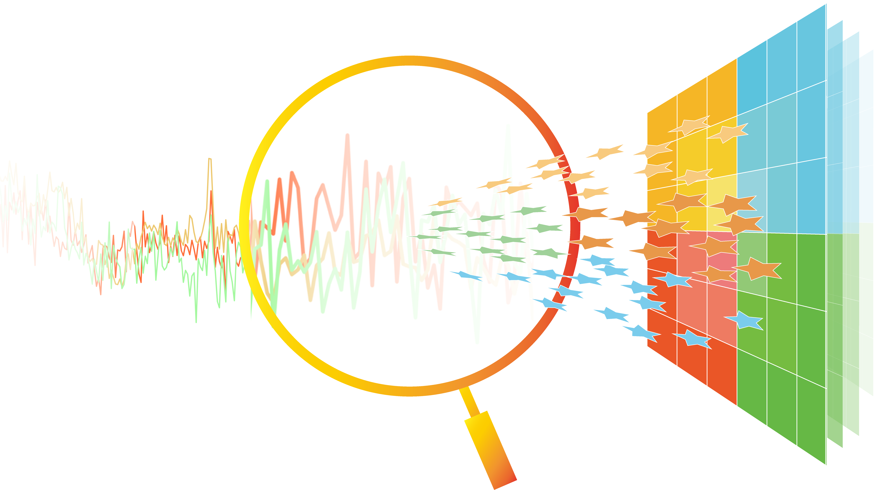

# SCAR


## Architecture of DSCARNet


---
- SCAR is a tool based on AggMap, which could transform the raman spectra data into 2-D format map.
- The performance of SCAR and DSCARNet was tested on 8 datasets listed here.
```
1.Gala de Pablo J, Armistead F J, Peyman S A, et al. Biochemical fingerprint of colorectal cancer cell lines using label‐free live single‐cell Raman spectroscopy[J]. Journal of Raman Spectroscopy, 2018, 49(8): 1323-1332.
2.Baria E, Cicchi R, Malentacchi F, et al. Supervised learning methods for the recognition of melanoma cell lines through the analysis of their Raman spectra[J]. Journal of Biophotonics, 2021, 14(3): 202000365.
3.Akagi Y, Mori N, Kawamura T, et al. Non-invasive cell classification using the Paint Raman Express Spectroscopy System (PRESS)[J]. Scientific reports, 2021, 11(1): 1-15.
4.Hsu C C, Xu J, Brinkhof B, et al. A single-cell Raman-based platform to identify developmental stages of human pluripotent stem cell-derived neurons[J]. Proceedings of the National Academy of Sciences, 2020, 117(31): 18412-18423.
5.García‐Timermans C, Rubbens P, Heyse J, et al. Discriminating bacterial phenotypes at the population and single‐cell level: a comparison of flow cytometry and Raman spectroscopy fingerprinting[J]. Cytometry Part A, 2020, 97(7): 713-726.
6.Pavillon N, Hobro A J, Akira S, et al. Noninvasive detection of macrophage activation with single-cell resolution through machine learning[J]. Proceedings of the National Academy of Sciences, 2018, 115(12): E2676-E2685.
7.Du J, Su Y, Qian C, et al. Raman-guided subcellular pharmaco-metabolomics for metastatic melanoma cells[J]. Nature communications, 2020, 11(1): 1-16.
8.Ho C S, Jean N, Hogan C A, et al. Rapid identification of pathogenic bacteria using Raman spectroscopy and deep learning[J]. Nature communications, 2019, 10(1): 4927.
```
- For more information about AggMap, please visit https://github.com/shenwanxiang/bidd-aggmap